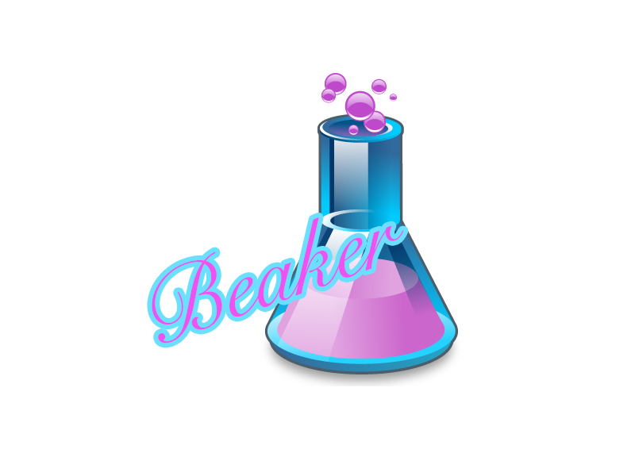

    

    
    
    
    

# Beaker

Beaker is a profiling tool with golang.

## Platforms

- Linux
- MacOS

## Install

## How to use

## Contributing

Raising a good question is the first step to participate a open source community. You can report issues [here](https://github.com/mebiusashan/beaker/issues). 

## License

This content is released under the (https://github.com/mebiusashan/beaker/blob/master/LICENSE) AGPLv3 License.

